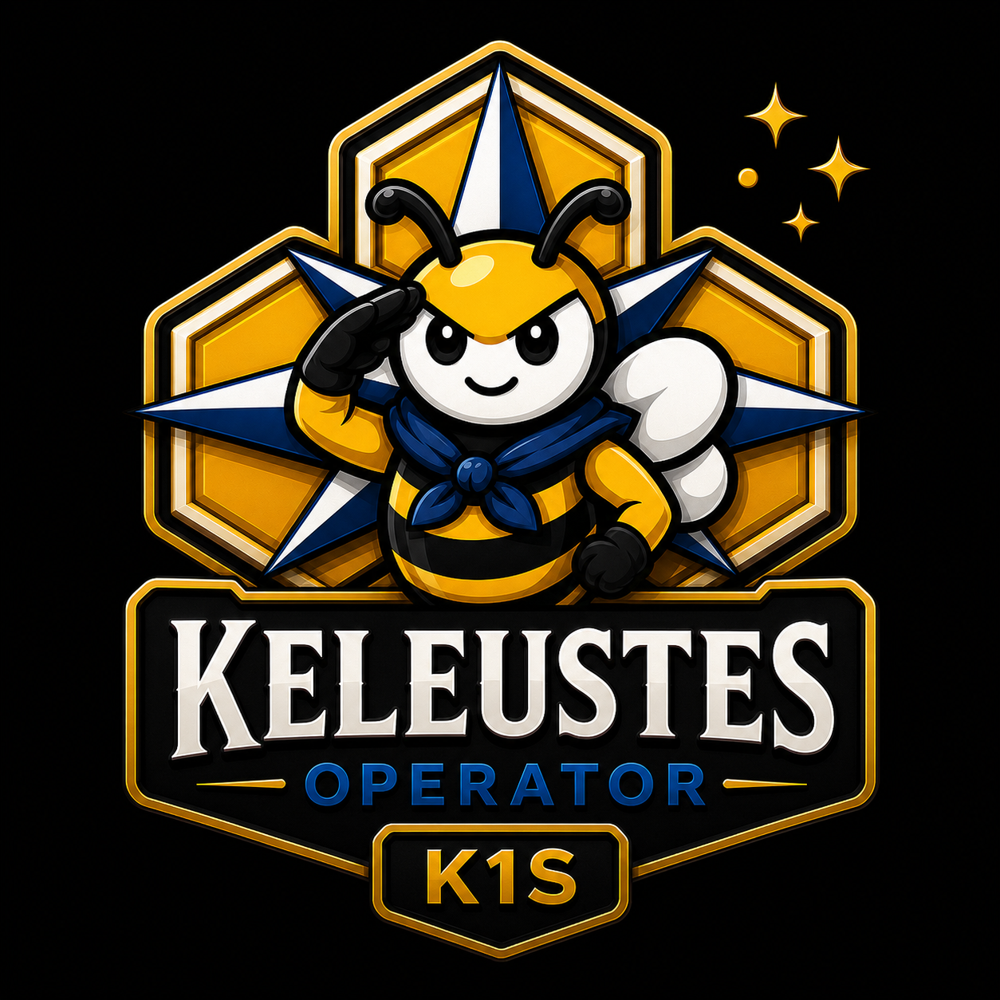

# Keleustes Operator

<p align="center">
  
</p>

**Keleustes** is the official name of `k1s-operator`, the Kubernetes operator that lets Kubernetes users consume selected k1s capabilities through Kubernetes-native APIs. It does not make k1s nodes schedulable Kubernetes nodes. Kubernetes workloads create and observe custom resources; the operator holds scoped k1s credentials and performs the k1s-side CRUD and discovery.

The project is pre-1.0 early development. Public defaults are intentionally conservative: namespace-scoped RBAC, localhost-bound metrics, non-root distroless runtime, a default ingress-deny NetworkPolicy for the controller pod, split read/write k1s tokens, and an operator-level cap on the k1s resource kinds that `K1sResourceSet` may manage.

The operator supports both standard service workflows and AI/ML workflows:

- standard k1s `Deployment` manifests through `K1sApp` and `K1sResourceSet`;
- AI/ML `InferenceCell` and `InferenceCellSet` intent through `K1sInferenceEndpoint` and `K1sResourceSet`;
- Kubernetes-side exposure through selectorless `Service`, managed `EndpointSlice`, optional `Ingress`, and optional traffic probes;
- k1s cluster discovery through status conditions on `K1sCluster`;
- namespace-scoped default RBAC for public-safe installs.

## Why "Keleustes"?

**Keleustes** (Ancient Greek: **Κελευστής**, *keleustḗs*)

Pronunciation:

> keh-leu-STAYS

Meaning:

> "The caller of commands"
>
> "The one who coordinates the crew"

In the great ships of the ancient Mediterranean, the **Keleustes** was the officer responsible for relaying commands and maintaining coordination among the rowers. While the helmsman determined the course, the Keleustes ensured the crew moved together as one.

The term derives from the Greek verb **κελεύω** (*keleúō*): "to command," "to direct," and "to urge forward."

Kubernetes itself derives from the Greek word **κυβερνήτης** (*kybernḗtēs*): "helmsman" or "steersman."

If Kubernetes is the helmsman, Keleustes is the officer who turns intent into coordinated action.

The Keleustes Operator exists to bridge Kubernetes and k1s, translating desired state, coordinating execution, and helping both systems work together.

## Our Symbol

The compass rose is a traditional mariner's symbol of guidance and safe return. In nautical tradition, the compass rose and north star symbolize finding your way home, staying true to your course, guidance through uncertainty, and loyalty to crew and mission.

For us, it reflects a simple idea:

> Build systems that help people find their way home.

Reliable. Legible. Cooperative.

A trusted first mate for Kubernetes and k1s.

## Architecture

Kubernetes remains the control plane for Kubernetes workloads and RBAC. k1s remains the runtime for resources that are uncommon or awkward in ordinary Kubernetes clusters, including edge delivery, proxy-backed service paths, GPU-backed inference cells, and k1s-native standard services.

```text
Kubernetes user/workload
  -> Kubernetes RBAC
  -> operator.k1s.io CRD
  -> k1s-operator controller
  -> scoped k1s controller API token
  -> k1s controller/runtime
```

The Kubernetes scheduler never places pods on k1s. The operator only translates authorized Kubernetes CRDs into k1s API calls and mirrors status back into Kubernetes.

## Custom Resources

| Kind | Purpose |
| --- | --- |
| `K1sCluster` | Describes a reachable k1s controller, credentials, polling, and proxy endpoint. |
| `K1sApp` | Applies and tracks one k1s standard `Deployment` manifest. |
| `K1sExposure` | Creates Kubernetes `Service`, `EndpointSlice`, optional `Ingress`, and optional traffic readiness for a k1s app. |
| `K1sInferenceEndpoint` | Builds and applies a k1s `InferenceCell` or `InferenceCellSet` for AI/ML inference workflows. |
| `K1sResourceSet` | Applies, prunes, and deletes a managed set of k1s resources, including standard and AI/ML kinds. |
| `K1sAppMirror` | Mirrors k1s app placement/status for exposure and discovery flows. |

## Quick Start

Build and verify locally:

```sh
make verify
```

Render the default install:

```sh
make kustomize-build
kustomize build config/default >/tmp/k1s-operator-default.yaml
```

Install into the default namespace-scoped deployment:

```sh
kubectl apply --server-side -f /tmp/k1s-operator-default.yaml
```

The operator expects a namespace-local Secret with separate read and write token keys when mutation CRDs are used. See [docs/installation.md](docs/installation.md) and [docs/security-rbac.md](docs/security-rbac.md).

Production installs should use HTTPS k1s controller URLs with a `ca.crt` bundle or public trust chain, versioned or digest-pinned operator images, Kubernetes RBAC for tenant access to CRDs, and scoped k1s tokens held only in the operator namespace.

## Documentation

- [Installation guide](docs/installation.md)
- [Public early-dev readiness](docs/public-readiness.md)
- [Security and RBAC guide](docs/security-rbac.md)
- [Troubleshooting guide](docs/troubleshooting.md)
- [Implementation plan](PLAN.md)

## License

Keleustes Operator is licensed under the Apache License, Version 2.0. See [LICENSE](LICENSE).

## Validation Status

The current checkpoint has passed:

- `make verify`;
- `govulncheck ./...`;
- kustomize builds for the default install and samples;
- server-side dry-runs for `config/default`.

The live AI/ML test requires a k1s controller build that supports `InferenceCell` and `InferenceCellSet` through `/apply` plus the native `/inference/*` routes.
